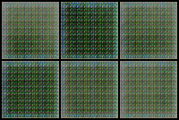
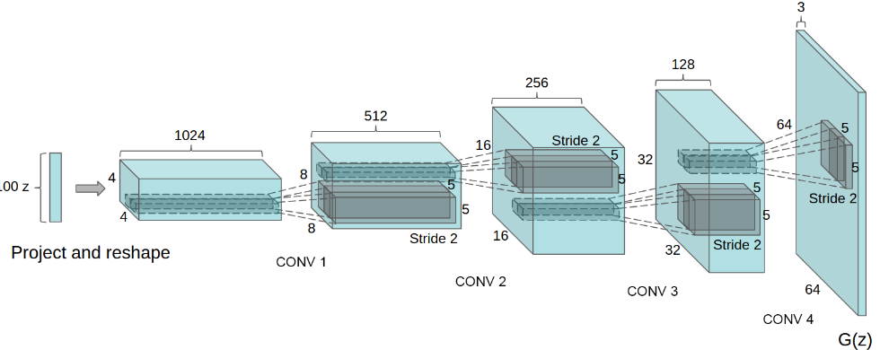

## PaintGAN

Goal of this project is to implement an GAN on a paint dataset which contains different art.
This dataset is available here: <a target="blank" href="https://huggingface.co/datasets/huggan/wikiart">Click here</a>

In a first time, to have a base line of which parameters used in our neural network, we resize images to 64x64.
And, we use neural network architecture of this paper [1]:

[1] Radford, A. (2015). Unsupervised representation learning with deep convolutional generative adversarial networks. arXiv preprint arXiv:1511.06434.
